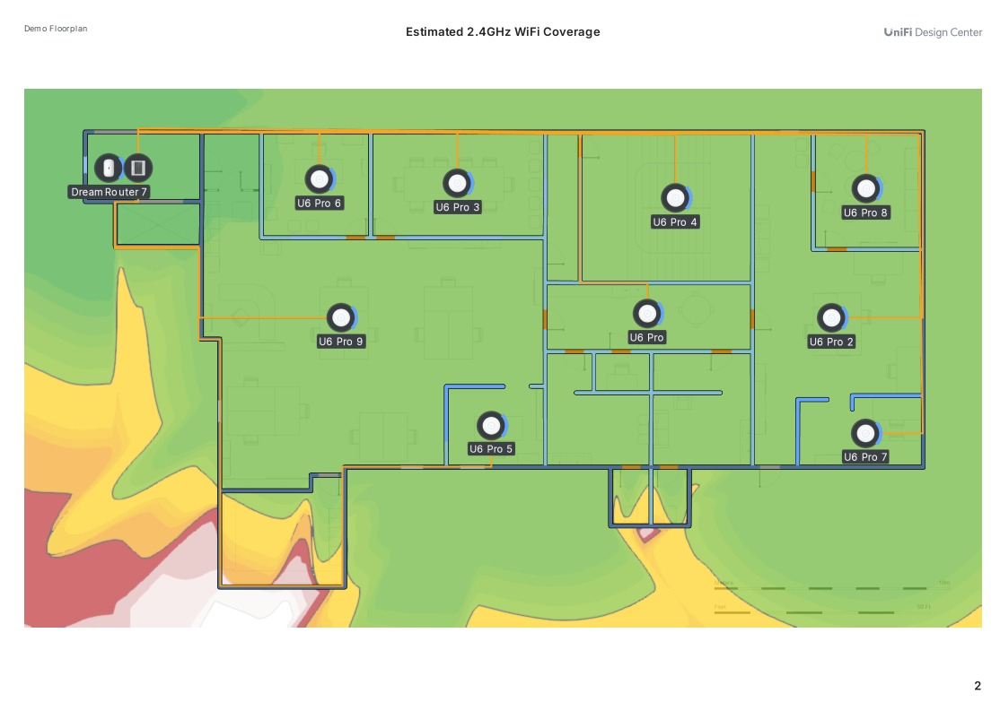
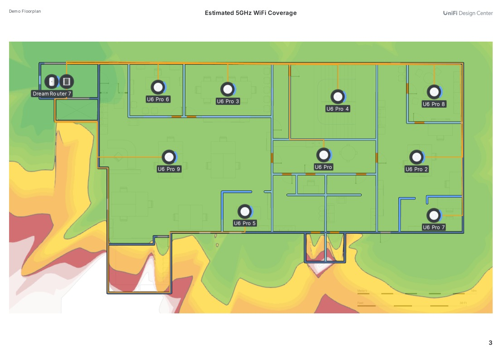

# Informe de Infraestructura de Red WiFi Corporativa

**Realizado por:** Grupo 3
**Documento:** Diseño y Justificación de la Infraestructura de Red Inalámbrica  
**Tecnología:** UniFi (Ubiquiti)  
**Fecha:** Abril 2026  

---

## 1. Introducción

El presente informe tiene como objetivo describir y justificar el diseño de la infraestructura de red inalámbrica implantada en las instalaciones de la empresa. La solución adoptada se basa en el ecosistema **UniFi de Ubiquiti**, reconocido por su escalabilidad, gestión centralizada y alto rendimiento en entornos empresariales.

El diseño parte de un análisis previo de las necesidades de conectividad de cada zona de trabajo, así como de la distribución física del edificio, con el fin de garantizar una cobertura WiFi estable, eficiente y sin interferencias entre puntos de acceso.

---

## 2. Equipamiento Instalado

### 2.1 Núcleo de Red — Rack 12U

En la zona superior izquierda del edificio se ha habilitado un armario rack de **12U** que actúa como centro neurálgico de toda la infraestructura de red. Este rack alberga los siguientes equipos:

#### Dream Router 7 (DR-7)

El **Dream Router 7** es el dispositivo central de gestión y enrutamiento de la red. Integra en un único equipo las funciones de:

- **Router** con capacidad de gestión avanzada del tráfico.
- **Controlador UniFi** embebido, que permite administrar todos los puntos de acceso y dispositivos de red desde una única interfaz centralizada (UniFi Network Application).
- **Firewall** y segmentación de redes mediante VLANs.
- **Servidor IDS/IPS** para la detección y prevención de intrusiones.

La elección de este dispositivo se justifica por la necesidad de centralizar la administración de toda la red en un único punto, simplificando la configuración, el monitoreo y el mantenimiento sin requerir un servidor dedicado adicional.

#### Switch Pro Max 24 PoE

El **Switch Pro Max 24 PoE** es el switch de distribución principal. Sus características clave son:

- **24 puertos PoE** (Power over Ethernet), que permiten alimentar eléctricamente todos los puntos de acceso directamente a través del cable de red, eliminando la necesidad de fuentes de alimentación individuales en cada AP.
- **Alta capacidad de switching**, adecuada para soportar el tráfico combinado de todos los puntos de acceso simultáneamente.
- **Gestión centralizada** desde el controlador UniFi del Dream Router 7.

Este switch es el corazón de la distribución de red: de él parten todos los cables que llegan a cada punto de acceso del edificio.

---

### 2.2 Puntos de Acceso — UniFi U6 Pro

Se han instalado un total de **9 puntos de acceso modelo UniFi U6 Pro**, distribuidos estratégicamente por las distintas estancias del edificio:

| AP | Ubicación |
|----|-----------|
| U6 Pro | Zona central del edificio |
| U6 Pro 2 | Zona derecha, planta principal |
| U6 Pro 3 | Zona superior central |
| U6 Pro 4 | Zona superior derecha central |
| U6 Pro 5 | Zona central inferior |
| U6 Pro 6 | Zona superior izquierda |
| U6 Pro 7 | Zona inferior derecha |
| U6 Pro 8 | Zona superior extremo derecho |
| U6 Pro 9 | Zona izquierda central |

#### Justificación del modelo U6 Pro

El **UniFi U6 Pro** es un punto de acceso de alto rendimiento que ofrece:

- **Compatibilidad WiFi 6 (802.11ax)**, con soporte para bandas de **2,4 GHz y 5 GHz** de forma simultánea.
- **MIMO 4x4** en 5 GHz y **MIMO 2x2** en 2,4 GHz, lo que maximiza el rendimiento en entornos con múltiples dispositivos conectados.
- **Cobertura amplia** diseñada para espacios de trabajo de tamaño medio-grande.
- **Alimentación PoE**, compatible con el switch instalado, sin necesidad de adaptadores de corriente independientes.
- **Gestión centralizada** desde el controlador UniFi, permitiendo configurar todos los APs de forma uniforme o individualizada.

---

## 3. Infraestructura de Cableado

Todo el cableado de red ha sido ejecutado de forma **estructurada y empotrada en paredes y techos**, siguiendo el trazado del plano del edificio. Cada punto de acceso está conectado mediante cable de red categoría 6 (Cat6) directamente al switch PoE ubicado en el rack, formando una **topología en estrella** desde el núcleo de red.

Este diseño garantiza:

- **Máxima fiabilidad** del backhaul (enlace entre el AP y el switch), ya que el cable Ethernet es inmune a interferencias de radiofrecuencia.
- **Aprovisionamiento eléctrico** de los APs a través del propio cable de red (PoE), simplificando la instalación.
- **Facilidad de mantenimiento** y escalabilidad futura, al tener un único punto de distribución centralizado.

---

## 4. Distribución Estratégica de los Puntos de Acceso

Cada uno de los 9 puntos de acceso ha sido ubicado de forma deliberada dentro de las estancias que requieren conectividad WiFi para el trabajo diario. Los criterios de ubicación han sido:

- **Cobertura por habitación:** cada AP cubre principalmente la estancia en la que está instalado, evitando la dependencia de señal proveniente de otras zonas.
- **Posicionamiento central:** los APs se han colocado preferentemente en el centro de cada espacio, para distribuir la señal de forma homogénea hacia todos los puntos de la habitación.
- **Minimización de obstáculos:** se ha tenido en cuenta la presencia de paredes, puertas y elementos estructurales que pudieran atenuar la señal.

---

## 5. Gestión de la Potencia de Transmisión y Prevención de Interferencias

Uno de los aspectos críticos en el diseño de redes WiFi con múltiples puntos de acceso es la **gestión del solapamiento de cobertura** entre APs vecinos. Cuando dos o más APs transmiten en la misma frecuencia y con potencia elevada, pueden producirse interferencias que degradan el rendimiento de la red.

Para evitar esta situación, se recomienda configurar correctamente la potencia de transmisión de cada punto de acceso siguiendo las siguientes pautas:

### 5.1 Ajuste de Potencia por Habitación

Cada U6 Pro debe configurarse con una potencia de transmisión ajustada para que su cobertura efectiva quede **contenida dentro de la habitación o zona que le corresponde**, evitando que la señal se extienda significativamente hacia espacios adyacentes donde ya existe otro AP.

En el controlador UniFi, esto se realiza desde:  
`Configuración del AP → Radio → Potencia de transmisión (TX Power) → Manual`

Se recomienda comenzar con valores bajos o medios e ir ajustando mediante mediciones reales de señal (RSSI) hasta encontrar el equilibrio óptimo.

### 5.2 Planificación de Canales

Adicionalmente, es fundamental asignar **canales no solapados** a los APs adyacentes:

- **Banda 2,4 GHz:** usar los canales 1, 6 y 11 (únicos canales no solapados en esta banda).
- **Banda 5 GHz:** dispone de un mayor número de canales no solapados, lo que facilita la planificación en entornos con muchos APs.

UniFi ofrece la funcionalidad de **optimización automática de canales** (AI WiFi / Band Steering), aunque se recomienda una planificación manual para entornos donde el control preciso de la cobertura es prioritario.

### 5.3 Función BSS Coloring (WiFi 6)

El estándar WiFi 6 implementado en los U6 Pro incluye la tecnología **BSS Coloring**, que permite a los APs identificar su propia "red" y reducir las colisiones en entornos con alta densidad de APs, mejorando la eficiencia espectral sin necesidad de una separación física extrema entre ellos.

---

## 6. Mapa de Cobertura Estimada

El mapa de calor adjunto (generado mediante UniFi Design Center) muestra la cobertura estimada en la banda de **2,4 GHz** para toda la planta del edificio. Las zonas en **color verde** indican una señal óptima (-65 dBm o superior), mientras que las zonas en **amarillo y naranja** reflejan una cobertura moderada, y las zonas en **rojo** indican señal débil o ausente.

### Cobertura estimada 2,4 GHz

### Cobertura estimada 5 GHz

Como se puede observar, la práctica totalidad del interior del edificio queda cubierta con señal de calidad óptima, gracias a la distribución planificada de los 9 puntos de acceso. Las zonas exteriores al edificio presentan señal decreciente, lo que es completamente esperado y deseable desde el punto de vista de la seguridad perimetral de la red.

---

## 7. Ventajas de la Solución Adoptada

La infraestructura diseñada ofrece las siguientes ventajas frente a soluciones alternativas:

| Característica | Beneficio |
|---|---|
| Gestión centralizada (UniFi Controller) | Administración unificada de todos los APs desde un único panel |
| Cableado PoE estructurado | Sin alimentadores independientes; instalación limpia y fiable |
| WiFi 6 (802.11ax) | Mayor velocidad, menor latencia y mejor rendimiento con múltiples dispositivos |
| Distribución por estancias | Cobertura focalizada, sin solapamientos y mejor experiencia de usuario |
| Ajuste de potencia por AP | Control preciso de la cobertura para evitar interferencias |
| Escalabilidad | Posibilidad de añadir nuevos APs o switches sin cambiar la arquitectura central |

---

## 8. Conclusión

La infraestructura de red inalámbrica implantada representa una solución **profesional, escalable y optimizada** para las necesidades actuales y futuras de la empresa. La combinación del Dream Router 7 como núcleo de gestión, el Switch Pro Max 24 PoE como distribución centralizada y los 9 puntos de acceso U6 Pro estratégicamente ubicados garantiza una cobertura WiFi de alta calidad en todas las zonas de trabajo del edificio.

La correcta configuración de la potencia de transmisión de cada AP, junto con una planificación adecuada de canales, asegurará que la red opere sin interferencias y con el máximo rendimiento posible, ofreciendo a los trabajadores una experiencia de conectividad fluida y estable en todo momento.
